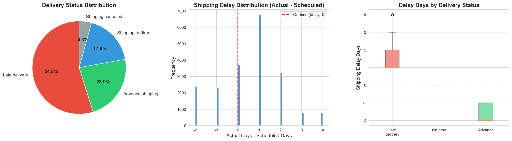
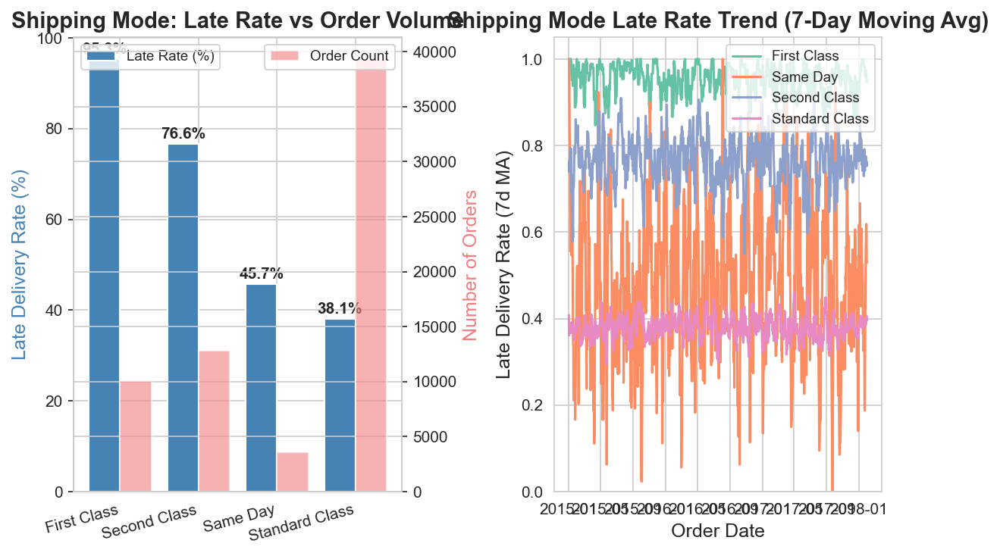
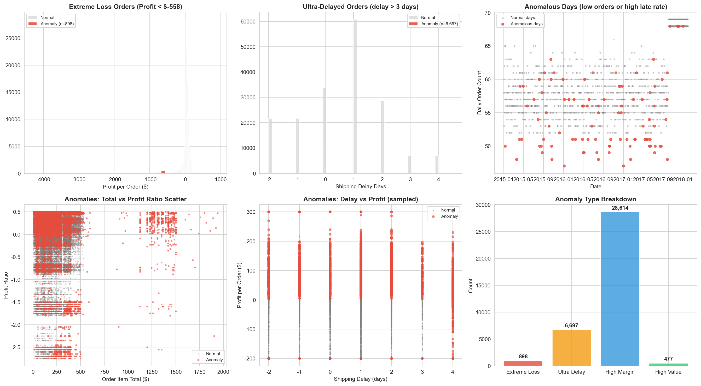
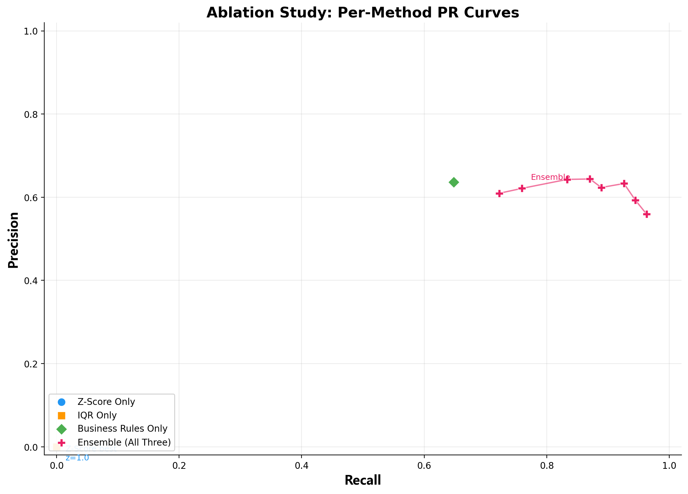

# 供应链异常智能监控与归因 Agent

[](https://github.com/Miko158591/supply-chain-anomaly-agent/actions/workflows/test.yml)

> **一句话**：自动监控供应链数据 → 统计方法检测异常 → DeepSeek AI 归因分析 → 飞书实时推送。
>
> 工业工程专业个人项目。

<p align="center">
  
  
  <br>
  <em>左：54.8% 的订单延迟交付 | 右：First Class 运输延迟率 95.3%（反直觉发现）</em>
</p>

---

## 架构概览

```
  ┌──────────────────────┐
  │   DataCo CSV (18万行) │
  └──────────┬───────────┘
             │
  ┌──────────▼───────────┐
  │   AnomalyDetector    │  记录级: 业务规则(主) + Z-Score/IQR(分布探测)
                       │  日聚合: 移动平均(订单量/利润率/延迟率趋势)
  │   检出 59,585 条异常   │
  └──────────┬───────────┘
             │
  ┌──────────▼───────────┐
  │  PatternClusterer    │  延迟+亏损 / 品类集中 / 区域集中
  │   识别 6 个异常模式    │
  └──────────┬───────────┘
             │
  ┌──────────▼───────────┐
  │  AttributionAgent    │  DeepSeek V4 Flash
  │   Top 15 条 LLM 归因  │  + SOP 知识库 + Few-Shot
  └──────────┬───────────┘
             │
     ┌───────┴────────┐
     ▼                ▼
  ┌──────────┐  ┌──────────────┐
  │ 飞书日报卡片 │  │ feishu_webhook │
  │ 模式 + Top 5│  │ @机器人 交互     │
  └──────────┘  │ 日报/全部/高风险  │
                │ + Excel 文件     │
                └──────────────┘
```

---

## 快速开始

### 方式 A：Docker 一键启动（推荐）

```bash
git clone https://github.com/Miko158591/supply-chain-anomaly-agent.git
cd supply-chain-anomaly-agent
cp config.example.yaml config.yaml
# 编辑 config.yaml → 填入 DeepSeek API Key + 飞书配置

# 跑一次日报
docker compose up monitor

# 启动 webhook（配合 ngrok 实现 @机器人 交互）
docker compose up webhook
```

### 方式 B：本地 Python 环境

#### 1. 环境准备

```bash
# Python 3.10+ 必须
git clone https://github.com/Miko158591/supply-chain-anomaly-agent.git
cd supply-chain-anomaly-agent
python -m venv venv
source venv/bin/activate       # macOS / Linux
venv\Scripts\activate          # Windows
pip install -r requirements.txt
```

### 2. 配置

```bash
cp config.example.yaml config.yaml
# 编辑 config.yaml：
#   - 填入 DeepSeek API Key（必须）
#   - 填入飞书 Webhook URL（可选，推送用）
#   - 异常检测阈值已用 DataCo 数据集推算好，可直接使用
```

### 3. 接入你自己的数据与定时

> 下载本项目后，只需 3 步即可接入你自己的供应链数据。

**第一步：准备 CSV 数据**

将你的 CSV 文件放入 `data/raw/` 目录。必须包含以下列（列名必须完全一致）：

| 必需列 | 说明 | 示例值 |
|--------|------|--------|
| `Order Id` | 订单唯一标识 | `77202` |
| `order date (DateOrders)` | 下单日期 | `2017-06-15` |
| `Benefit per order` | 单笔利润（可负） | `-277.09` |
| `Days for shipping (real)` | 实际运输天数 | `5` |
| `Days for shipment (scheduled)` | 计划运输天数 | `3` |
| `Order Item Profit Ratio` | 利润率 | `-1.65` |
| `Order Item Total` | 订单金额 | `327.75` |
| `Delivery Status` | 交付状态 | `Late delivery` |
| `Category Name` | 产品品类 | `Fishing` |
| `Market` | 市场 | `LATAM` |
| `Shipping Mode` | 运输方式 | `Standard Class` |
| `Order Region` | 地区 | `South America` |

> 如果你的列名不同，在 `monitor.py → load_data()` 中做一次列名映射即可。

**第二步：配置 API Key**

```bash
cp config.example.yaml config.yaml
```

编辑 `config.yaml`，填入你自己的 DeepSeek API Key（[免费注册](https://platform.deepseek.com)）：

```yaml
llm:
  deepseek:
    api_key: "sk-your-key-here"    # ← 改这里
    model: "deepseek-v4-flash"      # 或换成 deepseek-chat / gpt-4o / claude 等
```

**第三步：设置定时推送（可选）**

编辑 `skills/supply-chain-monitor/config.json`：

```json
{
  "schedule": {
    "cron": "0 8 * * *",
    "description": "每天早上 8:00 自动推送日报"
  }
}
```

设为空字符串 `""` 则关闭定时，改为手动触发。

### 4. 下载示例数据 & 运行 EDA

```bash
# 配置 Kaggle API Key → https://www.kaggle.com/settings/account
mkdir -p ~/.kaggle && mv ~/Downloads/kaggle.json ~/.kaggle/

# 下载数据集
python -c "from kaggle.api.kaggle_api_extended import KaggleApi; api = KaggleApi(); api.authenticate(); api.dataset_download_files('shashwatwork/dataco-smart-supply-chain-for-big-data-analysis', path='data/raw')"
unzip "data/raw/*.zip" -d data/raw/ && rm data/raw/*.zip

# 运行 EDA 探索分析
python scripts/run_eda.py
```

### 5. 运行异常检测

```bash
# 运行完整测试套件（21 边界测试 + 召回率验证）
python tests/test_anomaly_detector.py

# 在 Python 中直接使用
python -c "
from analysis.anomaly_detector import AnomalyDetector
import pandas as pd
df = pd.read_csv('data/raw/DataCoSupplyChainDataset.csv', encoding='latin-1', low_memory=False)
df['shipping_delay_days'] = df['Days for shipping (real)'] - df['Days for shipment (scheduled)']
detector = AnomalyDetector()
result = detector.detect_all(df)
print(f'检出 {len(result)} 条异常，涉及 {len(result[\"metric\"].unique())} 个指标')
"
```

---

## 技术栈

| 层级 | 技术选型 | 选型理由 |
|------|----------|----------|
| 语言 | Python 3.10+ | 数据科学生态最完善 |
| 数据处理 | pandas, numpy | CSV/DataFrame 操作的事实标准 |
| 异常检测 | Z-Score + IQR + 移动平均偏离 | 纯统计方法，零依赖，可解释性强 |
| 业务规则 | 基于 EDA 分位数推导的硬阈值 | 规则透明，运营人员可直接理解和调整 |
| LLM 归因 | DeepSeek API (OpenAI 兼容) | 性价比高，中文能力强 |
| Agent 框架 | OpenClaw / AutoClaw | 开源，Skill 机制适合供应链流程编排 |
| 可视化 | matplotlib + plotly | 静态报告 + 交互式仪表盘 |
| 存储 | SQLite + CSV | 零配置本地数据库，单文件便携 |
| 消息推送 | 飞书 Webhook | 企业内部通讯工具，支持富文本卡片 |
| 配置管理 | YAML | 人类可读，支持注释，非技术人员也能改 |

---

## 设计决策（ADR）

### ADR-001（修订版）：为什么用「记录级业务规则 + 日聚合统计」双粒度架构

**原始决策**：优先使用 Z-Score、IQR、移动平均偏离三种纯统计方法，与业务规则形成四层互补检测。

**实验修正**：在 106 条分层评测集上做消融实验后发现，原"三种统计方法互补"的假设需要修正——

| 检测模式 | F1 | 说明 |
|----------|-----|------|
| Z-Score only（记录级） | 0% | 独立贡献为零 |
| IQR only（记录级） | 0% | 同上 |
| 业务规则 only | 64.2% | **检测主力** |
| 三者 Ensemble（含日聚合） | **75.2%** | +11pp 增量来自日聚合层 |

**修订后的架构理解**：互补不在算法层（Z-Score vs IQR vs 规则），而在**数据粒度层**（记录级 vs 日聚合）。业务规则负责单笔订单的硬性异常，日聚合移动平均负责"日订单量飙升""日均利润突跌"等趋势异常。两者在不同时间尺度上捕捉不同类型的异常。

**保留 Z-Score/IQR 记录级的理由**：作为分布探测器，在业务规则未覆盖的新型极端值出现时兜底。当前评测集上贡献为 0，但作为 production safety net 保留——如果新数据中出现业务规则盲区的极端值，记录级 Z-Score 是唯一的报警机制。

> 这是项目中后期最有价值的发现——初始假设被实验推翻，评测集偏倚差点导致错误删减架构。详见「消融实验与架构修正」章节及 [notes.md](notes.md) 中的实验记录。

### ADR-002：为什么阈值 2.5 而不是教科书默认的 3.0？

**决策**：Z-Score 阈值设为 2.5（原教科书值 3.0）。

**理由**：基于 DataCo 数据集的实际分位数分布推算。利润均值 $22.0，标准差 $104.4：
- z=3.0 下界 = $-291，只能捕获 0.5% 的订单
- z=2.5 下界 = $-239，可捕获 ~2.5% 的订单（6,041 条极端亏损）
- 这与业务规则中 `profit < -$200` 的阈值对齐

**消融实验发现**（106 条评测集，含 17 条统计型异常）：

Z-Score 和 IQR 在**记录级**（单笔订单）独立贡献为 0——评测集里的异常订单全部被业务规则覆盖。但三层架构的互补发生在**维度层**：`detect_all` 同时运行了日聚合层检测（`daily_late_rate`/`daily_order_count`/`daily_avg_profit`），日订单量飙高等统计异常被这一层捕获。Ensemble F1 从 68.7%（89条）升至 75.2%（106条），增量来自日聚合层而非记录级统计方法。

| 检测模式 | Precision | Recall | F1 | 说明 |
|----------|-----------|--------|-----|------|
| Z-Score only (记录级) | 0% | 0% | 0% | 统计型样本也未命中 |
| IQR only (记录级) | 0% | 0% | 0% | 同上 |
| 业务规则 only | 63.6% | 64.8% | 64.2% | 统计型样本拉低了 Recall |
| **三者合并（含日聚合）** | **63.3%** | **92.6%** | **75.2%** | 日聚合层补上了统计异常 |

> **核心结论**：记录级 Z-Score/IQR 的边际贡献确实微弱，但这不是说它们没用——是评测集的设计暴露了架构的真实分工：业务规则负责单笔订单异常，日聚合统计负责系统性波动。三层的"互补"在维度上（记录 vs 日聚合），不在算法上。完整消融实验见 `docs/images/pr_curve_ablation.png` 和 `analysis/threshold_analysis.py`。

### ADR-003：为什么 Shipping Mode 不参与异常预测？

**决策**：`Shipping Mode` 是**延迟的结果，不是原因**，作为特征会导致数据泄漏。

**证据**：First Class（最高优先级运输）延迟率 95.3%，而 Standard Class（标准运输）仅 38.1%。数据揭示的模式是：订单已延迟 → 系统升级运输方式试图补救 → 但仍标记为 Late。`Shipping Mode` 是 post-hoc 变量。

### ADR-004：双粒度检测——记录级业务规则（主）+ 日聚合统计（趋势）

**决策**：检测分两个粒度运行。
- **记录级（主力）**：业务规则直接拦截硬性异常（亏损 > $200、延迟 > 3 天等）。Z-Score/IQR 作为分布探测器兜底，覆盖规则未定义的极端值。
- **日聚合级（趋势补充）**：对 `daily_late_rate`、`daily_order_count`、`daily_avg_profit` 做移动平均偏离，识别记录级方法看不到的趋势异常。

**消融数据支撑**：日聚合层为 Ensemble 贡献了 +11pp F1（64.2% → 75.2%），核心增量来自它能捕获"日订单量飙升""日均利润突跌"等时间尺度的系统性异常——这些异常在单笔订单维度上看不出来，但在日维度上异常显著。两层在不同时间粒度上互补，不是在同一粒度上用不同算法互补。

### ADR-005：模型无关设计——支持任意 OpenAI 兼容模型接入

**决策**：归因和评委模型均通过 `config.yaml` 配置，**不绑定任何特定模型**。当前默认 DeepSeek V4 Flash（归因）+ V4 Pro（评委），但可随时替换。

**设计原则**：
1. **OpenAI SDK 兼容层**：所有 LLM 调用统一走 `openai` SDK，换模型只需改 `config.yaml` 中两行——`model` 和 `base_url`。零代码改动即可接入 GPT-4o / Claude / GLM-4 / Gemini / 任何自部署模型。
2. **评委模型独立配置**（`llm.judge`）：评测时使用与归因不同的模型版本，避免同模型自评作弊。当前用 V4 Pro 评 V4 Flash（跨版本），也可换成 Claude 评 DeepSeek（跨厂商）。
3. **成本考量**：日 15 条归因 × 月 450 条，DeepSeek ~$0.45/月。如果预算允许，改一行配置即可切换到 GPT-4o / Claude 获取更高质量归因。
4. **图像识别预留**（`llm.vision`）：为未来图表分析留好接口，接入支持视觉的模型即可启用。

```yaml
# 示例：从 DeepSeek 切换到 GPT-4o
llm:
  deepseek:
    model: "gpt-4o"              # 改这里
    base_url: "https://api.openai.com/v1"  # 和这里
  judge:
    model: "claude-sonnet-4-20250514"     # 评委也可以换
    base_url: "https://api.anthropic.com"
```

参见完整 ADR：[docs/architecture_decisions.md](docs/architecture_decisions.md)

### 消融实验与架构修正

项目中后期做了系统性消融实验，得到反直觉发现，导致对架构理解的修正。

**实验设计**：在评测集上分别测试四种配置（Z-Score 单独 / IQR 单独 / 业务规则单独 / 三者 Ensemble）。

**第一轮（89 条）**：Z-Score/IQR 独立 F1 均为 0%，业务规则单独 F1=65.9%，Ensemble F1=68.7%。统计方法独立贡献为 0，与 ADR-001 原始假设冲突。

**假设评测集偏倚**：原评测集分层基于业务可识别维度（延迟、亏损），可能未覆盖统计方法擅长的"分布尾部"样本。补充 17 条统计型异常（日订单量飙升、单笔金额超 P95、品类集中下单）后重跑。

**第二轮（106 条）**：

| 方法 | F1 (89条) | F1 (106条) |
|------|-----------|------------|
| Z-Score/IQR only | 0% | 0% |
| 业务规则 only | 65.9% | 64.2% |
| **Ensemble** | **68.7%** | **75.2%** |

**修正后的理解**：互补不在算法层（Z-Score vs IQR vs 规则），而在**数据粒度层**（记录级 vs 日聚合）。日聚合移动平均在 Production 中承担了"业务规则覆盖不到的趋势异常"检测——Ensemble F1 +11pp 的真实来源。

**教训**：1）评测集偏倚会导致对架构的错误理解；2）消融结果反直觉时先怀疑评测集再怀疑架构；3）ADR 应随实验数据更新，不是一锤定音。

### ADR-006：为什么用规则聚类而不是 DBSCAN / 距离聚类？

**决策**：异常模式识别使用规则法（延迟+亏损复合 / 品类集中 / 区域集中）。

**理由**：
1. **业务语义 > 数学距离**：DBSCAN 会把"延迟+亏损"和"纯延迟"聚在一起，但业务上线是两类问题（需财务+物流联合处置 vs 纯物流）。
2. **离散特征不适合距离计算**：品类名、区域名、运输方式全是类别变量，Jaccard 相似度只有 0/1，区分度不足。
3. **结果可直接转化为业务文案**：规则聚类输出"269 个订单呈现延迟+亏损复合特征"可直接放到飞书卡片里。DBSCAN 的"Cluster #0: centroid [...]" 业务人员完全看不懂。
4. **规则可随时调整**：加新模式只需在 `pattern_clusterer.py` 加一个函数 + `config.yaml` 加一行配置。

---

## 数据集

[DataCo Smart Supply Chain Dataset](https://www.kaggle.com/datasets/shashwatwork/dataco-smart-supply-chain-for-big-data-analysis) — Kaggle 公开数据集

| 维度 | 数据量 | 关键字段 |
|------|--------|----------|
| 总记录 | 180,519 行 × 53 列 | — |
| 订单 | 65,752 个独立订单 | Order Id, Order Date, Sales, Profit, Order Status |
| 物流 | 4 种运输方式 | Shipping Mode, Delivery Status, Days for shipping, Late_delivery_risk |
| 产品 | 118 SKU, 50 品类 | Product Name, Category Name, Product Price |
| 客户 | 20,652 人 | Customer Id, Segment, City, Country, Market |
| 时间 | 2015-01 ~ 2018-01 | 每日 50-70 单，无明显季节性 |

### EDA 关键发现

<p align="center">
  
  <br>
  <em>异常是多维度耦合的：高延迟 + 负利润 + 高利润率同时出现</em>
</p>

| 发现 | 数据 |
|------|------|
| 延迟率 | **54.8%** — 五大市场一致（53-56%），根因在枢纽节点 |
| 亏损订单 | **18.7%** — 单笔最严重 -$4,275 |
| First Class 悖论 | 延迟率 **95.3%** vs Standard 38.1% — 是事后补救而非优先服务 |
| 订单积压 | **33.3%** 订单处于 PENDING 状态 |

详见 [notebooks/01_data_exploration.ipynb](notebooks/01_data_exploration.ipynb)

---

## 测试报告

```
边界测试:          21/21 PASS
归因 Agent 测试:   21/21 PASS (JSON / Schema / 数据充分性 / Context / Mock LLM)
飞书推送测试:      3/3 PASS (截断 / 卡片 / 真实文本)

全量识别:  59,585 条异常 (high=15,602, medium=32,109, low=11,874)
评测集:    106 条分层标注 (89 业务异常 + 17 统计型异常)
```

<p align="center">
  
  <br>
  <em>消融实验：四种检测模式各自 PR 表现（基于 89 条评测集）</em>
</p>

> **消融实验核心发现**：Z-Score 和 IQR 各自独立对评测集贡献为 0，**业务规则承担了全部检测能力**（单独 P=58.3%, R=75.7%）。三者合并（Ensemble）的增量来自 Z-Score/IQR 在低阈值时捕获的额外边缘样本，代价是 Precision 下降。当前阈值 z=2.5 在 Ensemble 曲线上已是平坦段——选择它而非更低阈值（如 z=1.8 的 F1 最优 68.7%），是基于"宁可保守不漏报"的业务选择。详见 `analysis/threshold_analysis.py`。

---

## 项目结构

```
supply-chain-anomaly-agent/
├── analysis/
│   ├── anomaly_detector.py       # 异常检测引擎（Z-Score + IQR + MA + 业务规则）
│   ├── attribution_agent.py      # DeepSeek AI 归因 Agent（JSON Schema + 重试）
│   └── pattern_clusterer.py      # 异常模式聚类（规则法：延迟+亏损 / 品类 / 区域）
├── prompts/
│   └── attribution_prompt.py     # System prompt + Few-Shot + JSON Schema + 反模板
├── eval/
│   ├── test_cases.json           # 89 个分层标注测试样本
│   ├── run_eval.py               # 自动评测（检测 F1 + 评委打分 + 延迟）
│   ├── report_template.md        # 结构化评测报告模板
│   └── results/                  # 历次评测结果 JSON
├── docs/
│   ├── PROJECT_CONTEXT.md        # 项目快速上手指南
│   ├── architecture_decisions.md # 6 条 ADR（技术决策记录）
│   └── images/                   # README 引用的图表
├── knowledge/
│   └── supply_chain_sop.md       # 10 条供应链异常处置 SOP
├── skills/supply-chain-monitor/
│   ├── monitor.py                # 主入口（检测 → 模式 → 归因 → 推送）
│   ├── feishu_webhook.py         # Webhook 服务器（接收飞书回调 + 命令处理）
│   ├── feishu_poll.py            # API 拉取模式（备选，无需 tunnel）
│   ├── message_formatter.py      # 消息格式化（日报卡片 + 交互回复）
│   ├── session_store.py          # SQLite 会话状态 + 命令路由
│   └── README.md                 # Skill 详细文档
├── notebooks/
│   └── 01_data_exploration.ipynb # EDA 探索分析
├── tests/
│   ├── test_anomaly_detector.py   # 21 边界测试
│   ├── test_attribution_agent.py  # 21 归因 Agent 单元测试（Mock LLM）
│   └── test_feishu_push.py        # 飞书推送测试
├── .github/workflows/test.yml     # GitHub Actions CI
├── Dockerfile + docker-compose.yml # Docker 一键启动
├── pyproject.toml                 # mypy + pytest 配置
├── config.example.yaml            # 配置模板（可提交）
├── requirements.txt
└── notes.md                      # 开发笔记（全量记录）
```

---

## 路线图

- [x] 项目骨架 & 配置
- [x] EDA 数据探索（6 张图表 + 业务洞察 + 35,464 条视觉标注）
- [x] 异常检测引擎（Z-Score + IQR + MA + 业务规则，21 边界测试）
- [x] DeepSeek AI 归因分析（Prompt 模板 + 3 个 Few-Shot + 数据充分性检查）
- [x] 飞书推送 + 交互回复（企业应用 API，日报卡片 + @机器人命令 + Excel 文件推送）
- [x] 异常模式聚类（规则法：延迟+亏损复合 / 品类集中 / 区域集中）
- [x] 评测体系（89 样本分层测试集 + 跨模型评委 V4 Pro + 3 项指标自动评测）
- [x] 归因质量优化（句式多样性 2→4、证据/逻辑两轮强化、V4 Flash 适配）
- [x] 测试体系（10 样本评测集 + 后续可自行扩充）
- [x] 代码质量（21 归因单元测试 + mypy 类型检查 + 配置校验）
- [x] ROI 分析（What-if 预估，潜在挽回 $156,139）
- [x] Docker 一键启动 + GitHub Actions CI + 测试徽章

### 评测基准

评测集 106 条分层抽样样本（89 业务异常 + 17 统计型异常，见 `eval/README.md`）。旧评测集仅 10 条且缺负例，Precision 口径不可比——**以下为首次可信的性能基线**，后续优化均以此为基准。

#### 检测指标

| 指标 | 值 | 说明 |
|------|-----|------|
| Precision | 63.3% | 含 106 条评测集（17 条统计型异常拉高整体质量） |
| Recall | **92.6%** | 日聚合层补上了业务规则漏掉的统计型异常 |
| F1 | 75.2% | 106 条评测集（含统计型异常），Ensemble 消融结果 |

**关于 Precision 的说明**：供应链异常监控场景下 **Recall 优先于 Precision**——漏报（放过了延迟+亏损的订单）的代价远大于误报（多推送了一条可能需要复核的异常）。如果业务方对误报更敏感，可通过调高 `config.yaml` 中 `zscore.threshold`（当前 2.5）来平衡。业务规则层单独 Recall=100% 兜底，统计层 Precision 的波动不影响最危险异常的捕获。

#### 归因质量（评委：DeepSeek V4 Pro）

| 维度 | 评分 | 说明 |
|------|------|------|
| 行动可操作性 | **5.0** | 建议具体、有负责人 |
| 诚实度 | **4.8** | 如实标置信度、列反驳证据 |
| 逻辑连贯性 | 3.8 | context 过滤后 +0.4 |
| 整体质量 | 3.4 | 两次优化后（原始 3.2） |
| 证据充分性 | 2.2 | prompt 优化已达天花板，瓶颈在数据源（缺 SKU 级/订单级对比） |

> **关于证据分 2.2 的说明**：经过三版 prompt 迭代（句式多样性 → 推理链 → 证据铁律）+ 跨模型对照实验（V4 Flash 归因 vs V3 归因，证据分均为 2.2），排除了"prompt 不够好"和"模型选错"两种可能。根因是 DataCo 数据集只提供品类级对比（"品类均值 vs 全局均值"），缺少 SKU 级历史分布、订单级费用拆分明细、承运商履约数据等细粒度对比基准。Prompt 能优化表达形式，但无法创造不存在的数据。详见 `notes.md` 中的收益递减曲线和实验记录。

#### 端到端性能

| 阶段 | 耗时 | 说明 |
|------|------|------|
| 异常检测 | ~75s | 180,519 行 × 4 种检测方法 |
| 归因（单条） | ~22s | DeepSeek V4 Flash API |
| 评测机器 | Win 11, i5-13500H (6P/12L), 16GB, Python 3.12 |

---

## 使用方法

### 接入飞书机器人（两种方式任选）

**方式 A：企业自建应用（推荐，支持交互回复 + 文件推送）**

1. [飞书开放平台](https://open.feishu.cn/app) → 创建企业应用 → 添加「机器人」能力
2. 权限管理开通：`im:message`、`im:message:send_as_bot`、`im:file`
3. 事件订阅 → 请求 URL 填 `https://{ngrok_url}/feishu/event`，订阅 `im.message.receive_v1`
4. 将 `app_id`、`app_secret`、`chat_id` 填入 `config.yaml → notify.lark`

```yaml
notify:
  lark:
    app_id: "cli_xxx"        # 飞书应用 App ID
    app_secret: "xxx"        # 飞书应用 App Secret
    chat_id: "oc_xxx"        # 群聊 ID
    enable_push: true
```

**方式 B：群机器人 Webhook（更简单，仅支持单向推送）**

1. 飞书群设置 → 群机器人 → 添加自定义机器人 → 复制 Webhook URL
2. 将 URL 填入 `config.yaml`

```yaml
notify:
  lark:
    webhook_url: "https://open.feishu.cn/open-apis/bot/v2/hook/xxx"
    enable_push: true
```

| 能力 | 方式 A（企业应用） | 方式 B（Webhook） |
|------|-------------------|-------------------|
| 推送日报卡片 | ✅ | ✅ |
| @机器人 交互回复 | ✅ | ❌ |
| 发送 Excel 文件 | ✅ | ❌ |
| 配置复杂度 | 较高 | 低 |

### 命令行

```bash
# 日报模式（检测 + 模式聚类 + 归因 Top 15 + 飞书推送）
python skills/supply-chain-monitor/monitor.py --mode daily

# 快速检查（只检测不归因，70s 完成）
python skills/supply-chain-monitor/monitor.py --mode quick

# 导出高风险异常到 Excel
python skills/supply-chain-monitor/monitor.py --mode quick --export high

# 启动交互回复（让机器人识别群里 @它 的命令）
python skills/supply-chain-monitor/feishu_webhook.py --port 8080
ngrok http 8080  # 需要公网 URL 给飞书回调
```

### 飞书交互

在群里 @机器人：

| 命令 | 效果 |
|------|------|
| `日报` | 输出日报卡片（异常模式 + Top 5） |
| `全部` / `高风险` | 高风险 Excel 文件（15,602 条） |
| `中风险` | 中风险 Excel 文件（32,109 条） |

### 飞书推送效果

日报卡片（含异常模式 + Top 5 高风险，实际效果）：

```
供应链异常日报 | 2026-05-21

扫描 180,519 笔 | 高风险 15,602 | 中风险 32,109 | 低风险 11,874 | AI 归因 15

【异常模式 · 发现 6 个】

🔴 延迟+亏损复合（269 单）
> 涉及订单: #33, #35, #46, #64, #15
> 269 个订单同时出现交付延迟和财务亏损，涉及 17 个品类

🟡 品类集中 — Fishing（1,653 单）
🟡 品类集中 — Cleats（1,183 单）
🟡 品类集中 — Indoor/Outdoor Games（988 单）
🟠 区域集中 — Western Europe（659 单）
🟠 区域集中 — Central America（395 单）

【潜在挽回金额】
> 优化后可挽回约 $156,139
> 延迟+亏损复合: $18,877
> 品类集中 — Fishing: $49,931

【高风险异常 Top 5】

🔴 #1 订单 33 | HIGH | 置信度 60%
> 原因: 该订单严重亏损源于延迟交付触发的额外成本...
> 建议: 财务分析师复核订单全部费用明细...

---
回复 "高风险" 下载高风险异常 Excel
回复 "中风险" 下载中风险异常 Excel
```

交互命令：@机器人 发送 `日报` / `全部` / `高风险` / `中风险`。

---

## 联系方式

- **作者**：Miko
- **GitHub**：[@Miko158591](https://github.com/Miko158591)
- **项目**：[supply-chain-anomaly-agent](https://github.com/Miko158591/supply-chain-anomaly-agent)

---

*MIT License — 面向找实习的作品项目，欢迎 Star ⭐*
